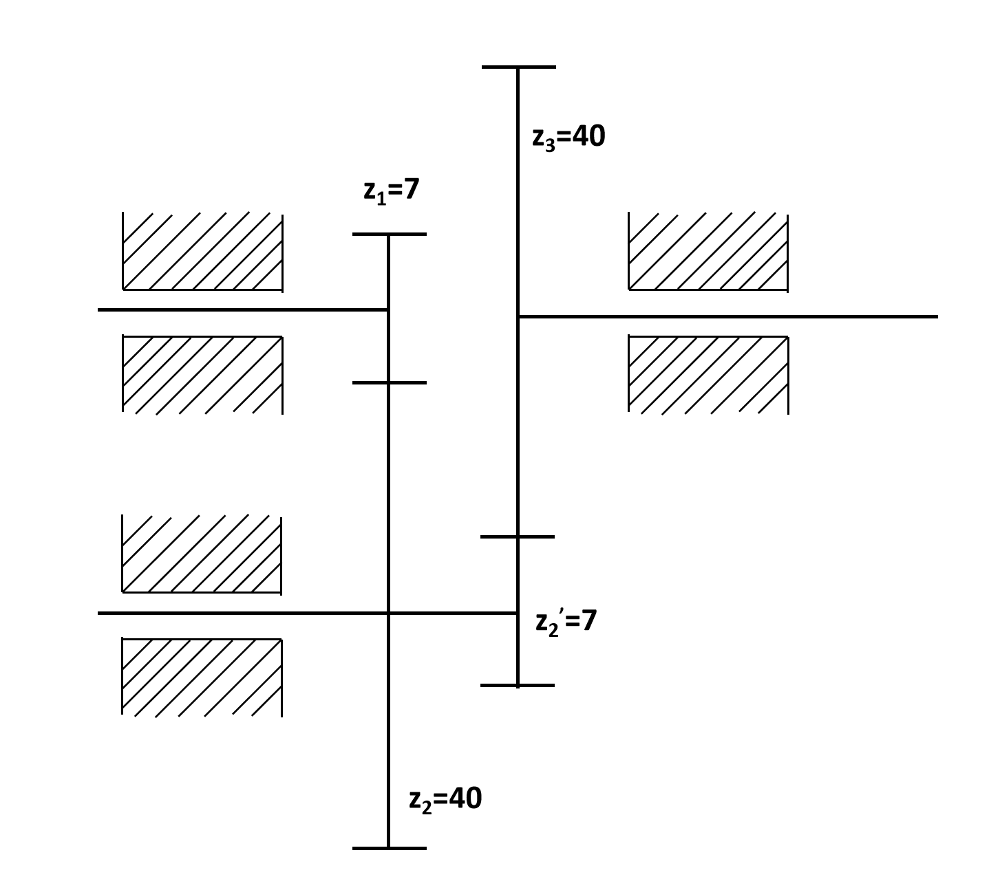

# 扑翼结构系统机械原理分析

## 一、分析对象

本结构的机械传动路线为：电机输入，经两级定轴齿轮减速后驱动曲柄，曲柄通过连杆带动摇杆摆动，摇杆再带动翅膀绕 A 点往复拍动。本文重点分析结构系统的运动与受力传递。

```text
电机 → 两级定轴齿轮 → 曲柄 BP1 → 连杆 P1P2 → 摇杆 AP2 → 翅膀外载
```

---

## 二、曲柄摇杆机构

实际机构简图如下。图中 `R=2.25` 对应曲柄半径 BP1，`c=14` 对应连杆 P1P2，`a` 为 A 点相对基准线的高度。


为便于受力分析，将实际机构抽象为如图所示的平面曲柄摇杆机构。机构简图中的大齿轮转轴处对应 B 点；曲柄端主点处对应 P1；连杆与翅膀摇杆连接铰点对应 P2；可动机架轴与翅膀摇杆连接铰点对应 A 点。

| 参数 | 数值 | 含义 |
|:---|---:|:---|
| `a` | 6.00 mm | AB点竖直距离，即摇杆/翅膀转轴高度 |
| `b` | 6.97 mm | AB点水平距离，即曲柄固定轴水平位置 |
| `R` | 2.25 mm | 曲柄 BP1 半径 |
| `c` | 14.00 mm | 连杆 P1P2 长度 |
| `l` | 8.00 mm | 摇杆 AP2 长度 |
| `phi_offset` | -30.0° | 翅膀安装偏角 |

其中 `a` 表示 A 点高度，`R` 才表示曲柄半径。

平面机构自由度为：

$$F = 3n - 2P_L - P_H = 3 \times 3 - 2 \times 4 - 0 = 1$$

因此，该扑翼执行机构为单自由度机构。电机只需提供一个连续转动输入，摇杆摆角由四杆几何关系唯一确定。

运动学计算采用当前设计参数：`a=6 mm, R=2.25 mm, phi_offset=-30°，f=17 Hz`。计算结果如下：

| 项目 | 数值 |
|:---|---:|
| 曲柄角速度 | 106.81 rad/s |
| 运动周期 | 58.82 ms |
| 翅膀摆角范围 | 15.18° ~ 70.98° |
| 总摆幅 | 55.80° |
| 峰值角速度 | 69.25 rad/s |
| 峰值角加速度 | 12375 rad/s² |

---

## 三、曲柄摇杆受力模型


按课本拆构件法，连杆 2 可近似看作二力杆，摇杆 3 承受翅膀传回的外载力矩 `M`，曲柄 1 承受驱动力矩 `Md`。图中各铰链处的红圈表示摩擦圆；考虑转动副摩擦时，铰链反力的作用线不再穿过销轴中心，而应与摩擦圆相切。若只作理想低副分析，可把摩擦圆半径近似取为 0，反力通过铰链中心。

各构件受力关系如下：

| 构件 | 主要受力 | 说明 |
|:---|:---|:---|
| 连杆 2 | `R12`、`R32` | 二力杆，二力等大、反向、共线 |
| 摇杆 3 | `R23`、`R43`、`M` | `M` 为翅膀侧等效外载力矩 |
| 曲柄 1 | `R21`、`R41`、`Md` | `Md` 为驱动曲柄所需力矩 |

作用反作用关系为：

$$R_{23}=-R_{32}, \qquad R_{21}=-R_{12}$$

翅膀侧外载采用等效力矩表示：

$$M_{wing} = M_{aero,A} + I_w \ddot\phi$$

其中 `M_aero,A` 取自气动模型中关于摇杆枢轴 A 的主矩，`Iw` 为翅膀等效转动惯量。为避免气动分段公式造成不符合真实流场连续性的小尖角，绘图和峰值统计前对气动力矩采用周期 Hann 窗平滑处理。这样可把复杂翅膀受力简化成作用在摇杆上的外载力矩。


图中气动等效力矩随拍动方向和有效攻角变化而改变符号；惯性力矩主要由 `phi_ddot` 决定，因此在摇杆换向附近幅值较大。局部尖峰主要来自两点：一是四杆机构换向附近角加速度变化快；二是气动模型中拍动方向、附加质量和 clap 修正按分段公式计算，跨过分段边界时曲线会出现较陡变化。这些尖峰对应传动系统需要重点校核的冲击载荷区间。

---

## 四、轮系传动分析



轮系为两级定轴外啮合齿轮传动。齿轮 2 与齿轮 2' 固连在同一中间轴上。

$$i_{12}=-\frac{z_2}{z_1}=-\frac{40}{7}=-5.7143$$

$$i_{2'3}=-\frac{z_3}{z_{2'}}=-\frac{40}{7}=-5.7143$$

$$i_{13}=i_{12}i_{2'3}=+32.6531$$

两级外啮合各改变一次转向，总传动比为正，所以输出轴与输入轴同向。

| 项目 | 数值 |
|:---|---:|
| 总传动比 `|i13|` | 32.6531 |
| 轮系总效率 `η_g` | 0.9319 |
| 模数 `m` | 0.3 mm |
| 压力角 `α` | 20.0° |
| 齿轮 1 分度圆直径 | 2.100 mm |
| 齿轮 3 分度圆直径 | 12.000 mm |

---

## 五、力矩逐级传递

采用功率等效法从摇杆外载反推到电机端。摇杆侧瞬时功率为：

$$P = M_{wing}\dot\phi$$

简化考虑曲柄摇杆转动副摩擦、摩擦圆和装配损失，取曲柄摇杆等效效率 `η_l=0.90`。因此曲柄轴所需输入扭矩为：

$$T_{crank} = \frac{P}{\omega_{crank}\eta_l}$$

齿轮减速器再折算到电机轴：

$$T_{motor} = \frac{T_{crank}}{i_{13}\eta_g} = \frac{P}{\omega_{crank}i_{13}\eta_l\eta_g}$$

计算得到：

| 项目 | 数值 |
|:---|---:|
| 摇杆外载合力矩峰值 | 1375.26 N.mm |
| 曲柄摇杆等效效率 `η_l` | 0.90 |
| 曲柄轴峰值扭矩 | 235.65 N.mm |
| 电机轴峰值扭矩 | 7.744 N.mm |
| 平均气动功率 | 1098.4 mW |
| 峰值总功率 | 22641.6 mW |


两条曲线形状相同，是因为电机轴扭矩由曲柄轴扭矩按固定传动比和轮系效率折算得到；幅值变小，反映两级减速器在电机端具有“高转速、低扭矩”的输入特点。正负号表示该瞬时载荷对曲柄转动方向的助推或阻碍。

---

## 六、齿轮啮合力

齿轮啮合力按直齿圆柱齿轮基本关系估算：

$$F_t=\frac{2T}{d}, \qquad F_r=F_t\tan\alpha, \qquad F_n=\frac{F_t}{\cos\alpha}$$

其中，`Ft` 为圆周力，方向沿分度圆切线，是传递扭矩的主要分量；`Fr` 为径向力，方向沿两齿轮中心连线，会压向轴承和机架；`Fn` 为法向啮合力，方向沿齿廓接触法线，是齿面真实接触力，可分解为 `Ft` 和 `Fr`。

峰值工况下：

| 啮合副 | Ft | Fr | Fn |
|:---|---:|---:|---:|
| 齿轮 1-2 | 7.376 N | 2.685 N | 7.849 N |
| 齿轮 2'-3 | 39.275 N | 14.295 N | 41.796 N |


第二级啮合力大于第一级，原因是减速后输出端扭矩增大。

---

## 七、结论

该结构可按单自由度曲柄摇杆机构进行机械原理分析。翅膀气动与惯性载荷先等效为摇杆端外载力矩，再通过功率等效法和曲柄摇杆等效效率换算到曲柄轴，最后按齿轮传动比和轮系效率折算到电机端。当前设计参数下，曲柄轴峰值扭矩约 `235.65 N.mm`，电机轴峰值扭矩约 `7.744 N.mm`；齿轮第二级峰值圆周力约 `39.28 N`。

输出数据见：

```text
output\tables\mechanical_principles_summary.json
```
